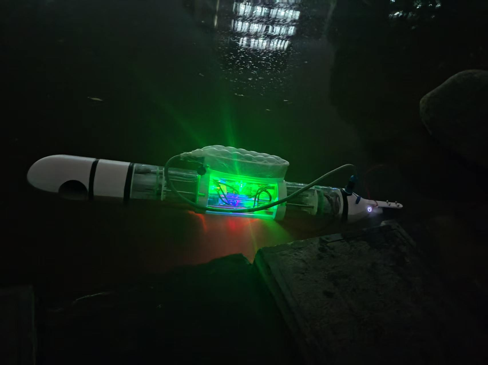
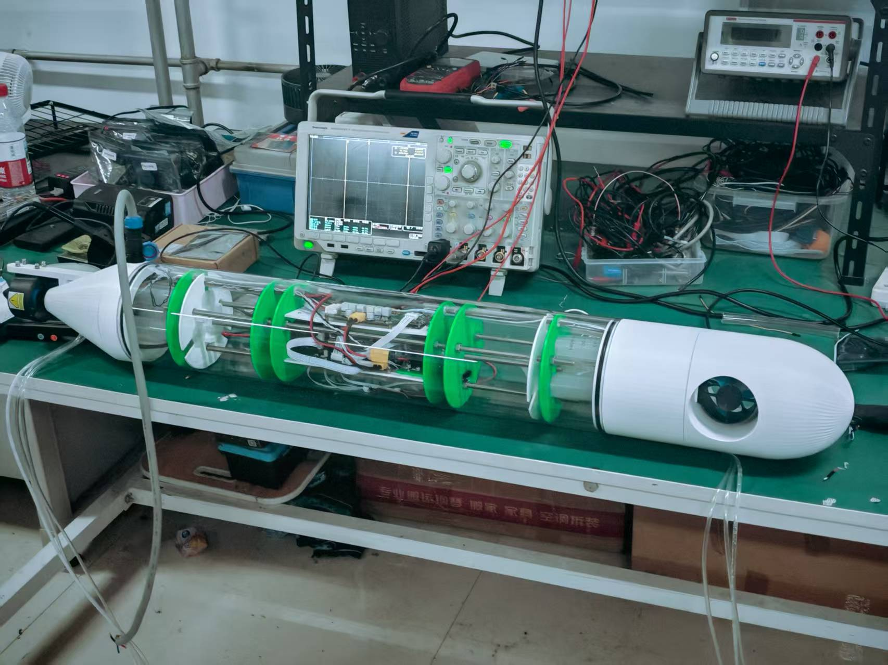

# DW 水下无人机控制固件

## 项目简介
本项目是一个基于 STM32H723 的水下无人机控制固件工程，当前代码包含推进控制、压载水舱控制、手柄输入、GPS 定位、IMU 姿态读取，以及基于 GPS 圆形活动范围的自动返航导航逻辑。

工程主体采用 STM32CubeMX 生成的 HAL 工程作为底座，用户代码集中在 `UserCode/` 目录下，适合在现有硬件平台上继续迭代控制与导航功能。

## 当前主要功能
- 手柄输入解析与控制
- 双推进器速度控制
- 前后水舱进排水控制
- 步进电机驱动与梯形速度规划
- GPS 数据接收与解析
- JY901 IMU 数据接收与姿态读取
- 基于目标圆心与半径的自动返航控制
- 超出活动范围后的转向 + 前进闭环控制

## 工程目录结构
```text
DW/
├─ Core/                STM32CubeMX 生成的启动与主工程代码
├─ Drivers/             HAL / CMSIS 驱动
├─ MDK-ARM/             Keil MDK 工程文件与构建产物
├─ UserCode/
│  ├─ APP/              业务应用层，包含导航、控制、水舱、GPS 等模块
│  ├─ BSP/              板级支持层，包含中断、串口、延时、传感器底层适配
│  ├─ MID/              中间层与通用功能模块
│  └─ foc_lib/          FOC 相关底层库
└─ docs/                设计说明与补充文档
```

## 关键模块说明

### `Core/Src/main.c`
主程序入口，负责：
- HAL 与外设初始化
- 手柄、压载水舱、GPS、导航模块初始化
- 在主循环中周期调用各业务模块

当前主循环里能看到的核心调用包括：
- `Gamepad_Control()`
- `APP_GPS_Task()`
- `Navigation_Task()`
- `Water_Tank_Update_Handler()`

### `UserCode/APP/`
主要业务逻辑集中在这里：
- `navigation.c / navigation.h`：自动返航导航逻辑
- `gamepad.c / gamepad.h`：手柄协议解析
- `PID.c / PID.h`：PID 控制器
- `app_gps.c / app_gps.h`：GPS 业务层接口
- `WaterTank.c / WaterTank.h`：前后水舱控制
- `control.c / control.h`：推进器与控制相关接口
- `app_thrusters.c / app_thrusters.h`：推进器初始化与封装

### `UserCode/BSP/`
硬件相关的底层接入：
- `bsp_interrupt.c`：中断入口
- `bsp_gps.*`：GPS 底层接收
- `bsp_jy901.*`：JY901 IMU 底层接收
- `bsp_comm_wifi.*`：通信相关底层接口
- `bsp_delay.*`：延时功能

### `UserCode/MID/`
中间层与通用功能：
- `mid_gps.*`：GPS 中间处理
- `JY901.*`：姿态模块协议处理
- `H_Tmc2209.*`：步进电机驱动
- `user_math.*`：运动控制相关数学工具

## 导航功能说明
当前导航模块实现的是“圆形活动范围保持 / 超界返航”思路：

1. 设置目标圆心和活动半径
2. 周期读取当前位置 GPS
3. 判断当前位置是否超出目标圆
4. 若超界，则计算目标方向
5. 利用当前航向角和 PID 输出转向控制量
6. 在航向误差足够小时叠加前进推力
7. 回到范围内后停止推进并退出返航状态

相关接口：
- `Navigation_Init()`
- `Navigation_SetTarget()`
- `Navigation_Enable()`
- `Navigation_Task()`
- `Navigation_Stop()`
- `Navigation_IsOutside()`

当前导航实现依赖：
- GPS 位置数据
- JY901 输出的航向角
- `PID.c` 中的转向控制器
- `FOC_Set_Speed()` 推进器速度控制接口

## 压载与步进电机说明
压载系统通过步进电机驱动前后水舱执行进排水，用于调节姿态或浮力。

相关模块：
- `WaterTank.*`：水舱状态与目标水量控制
- `H_Tmc2209.*`：步进电机控制
- `user_math.*`：梯形速度规划相关计算

当前代码中定义了：
- 水舱空 / 中间 / 满状态
- 进水 / 排水过程控制
- 限位事件处理
- 步数与速度联合控制

## 开发与编译

### 开发环境
- MCU：STM32H723
- 工程管理：STM32CubeMX
- 编译环境：Keil MDK-ARM

### 打开方式
1. 使用 Keil 打开 `MDK-ARM/Project.uvprojx`
2. 按当前硬件连接确认串口、定时器、GPIO、DMA 配置
3. 编译并下载到目标板

### 外设配置来源
- `Project.ioc`：CubeMX 工程配置文件
- `Core/` 与 `Drivers/`：由 CubeMX / HAL 生成与维护

若修改了时钟、串口、DMA、定时器或 GPIO，建议优先在 `Project.ioc` 中调整后再重新生成工程。

## 文档说明
- `docs/StationKeepingDesign.md`：Station Keeping / 超界返航相关设计说明

## 实物展示

### 实物图片




### 演示视频
- [点击查看实物演示视频](实物/54e16329a46a27d9f53bbaebabfcf972.mp4)

> 说明：GitHub README 对本地视频通常以链接方式展示，图片可直接在页面中预览。

## 维护建议
- 新增业务逻辑时，优先放在 `UserCode/APP/`
- 新增硬件接入时，优先放在 `UserCode/BSP/` 或 `UserCode/MID/`
- `Core/` 与 `Drivers/` 尽量保持为 CubeMX 生成代码，减少手工侵入
- 修改导航逻辑时，重点关注 GPS 有效性、目标点有效性、航向误差阈值和 PID 参数

## 当前状态说明
当前仓库正处于持续迭代中，近期改动主要集中在：
- 导航模块稳定性
- 超界返航逻辑
- 数学工具模块从 `math.*` 向 `user_math.*` 迁移

因此在阅读代码时，建议优先关注：
- `UserCode/APP/navigation.*`
- `UserCode/APP/PID.*`
- `UserCode/MID/H_Tmc2209.*`
- `UserCode/MID/user_math.*`
